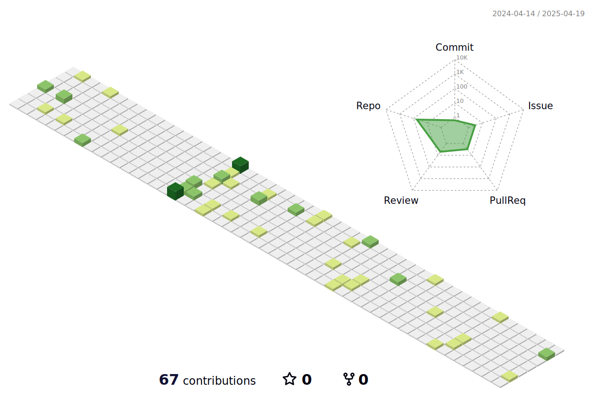

### Hi there 👋

- 🔭 I’m currently working on Java
- 🌱 I’m currently learning Rust
- 👯 I’m looking to collaborate on rust
- 💬 Ask me about ...
- 📫 How to reach me: ...
- 😄 Pronouns: ...
- ⚡ Fun fact: ...

### Profile Views
counting of visitors to this page in this section started from July 30, 2023

</img>

